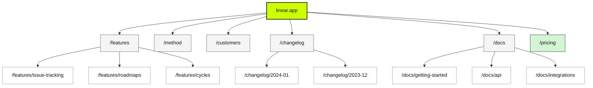

# Sample Output Excerpt

This document shows abbreviated examples of expected output quality from the Website Intelligence Skill.

---

## Example: site-map-report.md (Excerpt)

````markdown
# Site Intelligence Report: linear.app

> Generated: 2024-01-15 | Mode: Deep | Pages analyzed: 47 | Confidence: High

---

## Executive Summary

Linear is a modern project management tool targeting software development teams. The site architecture reflects a product-led growth strategy with clear pathways from awareness (homepage, features) to conversion (pricing, signup).

The site demonstrates strong information architecture with logical URL structures and consistent template usage across 5 identified page families. SEO fundamentals are solid with 94% metadata coverage, though structured data implementation presents an opportunity for enhanced SERP visibility.

Key finding: The changelog section (23 pages) represents significant content investment but has limited internal linking from the main site navigation, potentially reducing its discoverability and SEO impact.

---

## Site Architecture

### Hierarchy Diagram


````

### Navigation Structure

| Level                | Pages | Examples                                                           |
| -------------------- | ----- | ------------------------------------------------------------------ |
| L0 (Root)            | 1     | linear.app                                                         |
| L1 (Primary nav)     | 7     | /features, /method, /customers, /pricing, /docs, /changelog, /blog |
| L2 (Section content) | 28    | /features/issue-tracking, /docs/getting-started                    |
| L3+ (Deep content)   | 11    | /docs/api/authentication, /changelog/2024-01-15                    |

---

## Template Families

| Template      | Page Count | Dominant Sections                 | User Goal                          |
| ------------- | ---------- | --------------------------------- | ---------------------------------- |
| Homepage      | 1          | hero, features, social-proof, cta | Understand value prop, start trial |
| Feature Page  | 8          | hero, feature-detail, cta         | Learn about specific capability    |
| Documentation | 24         | sidebar, content, toc             | Find implementation details        |
| Changelog     | 12         | content, navigation               | Review recent updates              |
| Marketing     | 2          | hero, content, cta                | Learn methodology, see customers   |

---

## SEO Overview

### Metadata Quality

| Element           | Coverage     | Quality Notes                          |
| ----------------- | ------------ | -------------------------------------- |
| Title tags        | 47/47 (100%) | Consistent format: "{Page} - Linear"   |
| Meta descriptions | 44/47 (94%)  | 3 changelog pages missing              |
| H1 tags           | 47/47 (100%) | Single H1 per page                     |
| Open Graph tags   | 45/47 (96%)  | Missing on 2 utility pages             |
| Canonical tags    | 47/47 (100%) | Self-referencing, properly implemented |
| Structured data   | 2/47 (4%)    | Only homepage and blog posts           |

### SEO Issues

| Issue                     | Severity | Pages Affected | Recommendation                          |
| ------------------------- | -------- | -------------- | --------------------------------------- |
| Missing structured data   | Medium   | 45             | Add Organization, Product, FAQ schema   |
| Thin changelog entries    | Low      | 5              | Combine minor updates or expand content |
| Missing meta descriptions | Low      | 3              | Add descriptions to all changelog pages |

---

## Statistics

| Metric                          | Value    |
| ------------------------------- | -------- |
| Total URLs discovered           | 156      |
| Pages analyzed in detail        | 47       |
| Template families identified    | 5        |
| Maximum click depth             | 3 levels |
| Pages with forms                | 8        |
| Pages with CTAs                 | 42       |
| Average internal links per page | 12.3     |

---

## Risks, Anomalies & Opportunities

### Risks

| Risk                | Severity | Impact                                    | Recommendation                                   |
| ------------------- | -------- | ----------------------------------------- | ------------------------------------------------ |
| Changelog isolation | Medium   | Reduced SEO value from content investment | Add changelog widget to homepage, link from blog |

### Opportunities

| Opportunity                | Impact | Effort | Recommendation                                 |
| -------------------------- | ------ | ------ | ---------------------------------------------- |
| Structured data            | High   | Low    | Add JSON-LD for Product, FAQ, and Organization |
| Feature page interlinking  | Medium | Low    | Cross-link related features                    |
| Blog/changelog integration | Medium | Medium | Reference changelog in relevant blog posts     |

````

---

## Example: page-diagrams.md (Excerpt)

```markdown
# Page Structure Diagrams: linear.app

> Generated: 2024-01-15 | Templates documented: 5

---

## Homepage

**URL:** https://linear.app
**Template:** Homepage (unique)
**Purpose:** Primary landing page establishing Linear as a modern issue tracking tool
**User Goal:** Understand value proposition, start free trial

````

+============================================================+
|| linear.app ||
+============================================================+
| HEADER |
| [logo] [nav: Features Method Customers Pricing Docs] |
| [Login] [Sign up] |
+------------------------------------------------------------+
| |
| HERO |
| "Linear is a better way to build products" |
| "Meet the system designed for modern software teams" |
| |
| [Start for free] [Talk to sales] |
| |
| [product_screenshot] |
| |
+------------------------------------------------------------+
| SOCIAL-PROOF |
| "Trusted by product teams at" |
| [Vercel] [Ramp] [Loom] [Cash App] [Retool] [Watershed] |
+------------------------------------------------------------+
| FEATURES |
| +--------------------+ +--------------------+ |
| | Issue Tracking | | Cycles & Roadmaps | |
| | [icon] | | [icon] | |
| | Plan and track | | Plan and prioritize| |
| | with ease | | work | |
| | [Learn more ->] | | [Learn more ->] | |
| +--------------------+ +--------------------+ |
| +--------------------+ +--------------------+ |
| | Projects | | Integrations | |
| | [icon] | | [icon] | |
| | Organize work | | Connect your tools | |
| | into projects | | | |
| | [Learn more ->] | | [Learn more ->] | |
| +--------------------+ +--------------------+ |
+------------------------------------------------------------+
| CTA |
| "Built for the way you work" |
| "Linear adapts to your workflows with powerful features" |
| [Start building ->] |
+------------------------------------------------------------+
| TESTIMONIALS |
| +------------------------------------------------------+ |
| | "Linear is the first tool that actually feels like | |
| | it was designed for how modern teams work." | |
| | - {Name}, {Title} at {Company} | |
| +------------------------------------------------------+ |
| [< prev] [ o o o ] [next >] |
+------------------------------------------------------------+
| FOOTER |
| Product Company Resources Legal |
| Features About Blog Privacy |
| Pricing Careers Docs Terms |
| Changelog Contact Status Security |
| |
| [Twitter] [GitHub] [LinkedIn] [theme_toggle] |
+============================================================+

```

**Section Notes:**
- Hero uses product screenshot as social proof
- Feature cards link directly to detailed feature pages
- Testimonial carousel provides additional social proof
- Footer is comprehensive with 4 navigation columns

---

## Feature Page Template

**Representative URLs:**
- /features/issue-tracking
- /features/roadmaps
- /features/cycles

**Template:** Feature Page
**Purpose:** Deep dive into specific product capability
**User Goal:** Understand feature details, see how it works, decide to try
**Dominant Sections:** header, hero, feature-showcase, benefits, cta, footer

```

+============================================================+
|| Feature Page ||
+============================================================+
| HEADER |
| [logo] [nav: Features Method Customers Pricing Docs] |
| [Login] [Sign up] |
+------------------------------------------------------------+
| HERO |
| [breadcrumb: Features > {feature_name}] |
| |
| "{feature_headline}" |
| "{feature_description - 2-3 sentences}" |
| |
| [Start for free] |
+------------------------------------------------------------+
| FEATURE-SHOWCASE |
| +------------------------------------------------------+ |
| | | |
| | [large_product_screenshot_or_animation] | |
| | | |
| +------------------------------------------------------+ |
+------------------------------------------------------------+
| BENEFITS (alternating layout) |
| |
| +------------------------+ +------------------------+ |
| | {benefit_1_text} | | [screenshot_1] | |
| | "Benefit headline" | | | |
| | {description} | | | |
| +------------------------+ +------------------------+ |
| |
| +------------------------+ +------------------------+ |
| | [screenshot_2] | | {benefit_2_text} | |
| | | | "Benefit headline" | |
| | | | {description} | |
| +------------------------+ +------------------------+ |
+------------------------------------------------------------+
| CTA |
| "Ready to try {feature_name}?" |
| [Start for free] [Book a demo] |
+------------------------------------------------------------+
| FOOTER |
| [standard_footer] |
+============================================================+

```

**Section Notes:**
- Alternating image/text layout creates visual rhythm
- Large product screenshots demonstrate real functionality
- Clear conversion CTAs after feature explanation

---

## Documentation Template

**Representative URLs:**
- /docs/getting-started
- /docs/api/authentication
- /docs/integrations/github

**Template:** Documentation
**Purpose:** Technical reference and implementation guides
**User Goal:** Find specific information, implement integration, troubleshoot
**Dominant Sections:** header, sidebar-nav, content, toc, footer

```

+============================================================+
|| Documentation ||
+============================================================+
| HEADER |
| [logo: Linear Docs] [search] [GitHub] [Back to app] |
+------------------+-----------------------------------------+
| SIDEBAR-NAV | CONTENT | TOC |
| | | |
| Getting Started | [H1: {page_title}] | On this |
| - Overview | | page |
| - Quick start | {intro_paragraph} | --------|
| [active] | | {h2_1} |
| - Installation | [H2: {section}] | {h2_2} |
| | | {h3_1} |
| Core Concepts | {explanatory_content} | {h2_3} |
| - Issues | | |
| - Projects | `typescript               |         |
|  - Cycles        |  // Code example             |         |
|                  |  const linear = new Linear() |         |
|  API Reference   |  ` | |
| - Authentication| | |
| - Issues API | +-------------------------+ | |
| - GraphQL | | NOTE | | |
| | | Important information | | |
| Integrations | | about this feature | | |
| - GitHub | +-------------------------+ | |
| - Slack | | |
| - Figma | [H2: {section}] | |
| | | |
+------------------+ {more_content} +---------+
| | |
| | [< Previous: {page}] [Next: {page} >]|
+------------------+----------------------------------------+
| FOOTER |
| [Edit on GitHub] Was this helpful? [Yes] [No] |
+============================================================+

```

**Section Notes:**
- Collapsible sidebar navigation with section grouping
- Sticky table of contents for long pages
- Code examples with syntax highlighting
- Feedback mechanism in footer
```

---

## Quick Mode Example (Condensed)

When running in Quick Mode, outputs are lighter with confidence caveats:

```markdown
# Site Intelligence Report: example.com

> Generated: 2024-01-15 | Mode: Quick (Web Search) | Confidence: Medium

> **Note:** This analysis used Web Search reconnaissance. Structural details
> are inferred from content rather than DOM inspection.

---

## Executive Summary

Example.com appears to be a SaaS platform focused on team collaboration. Based on
search results and homepage analysis, the site follows a standard product marketing
structure with dedicated feature pages, pricing, and documentation.

_Confidence: Medium - based on search results and limited page fetches_

---

## Site Architecture (Inferred)

Main sections identified from navigation and search results:

- /features - Product capabilities
- /pricing - Pricing plans
- /docs - Documentation
- /blog - Company blog
- /about - Company information

_Note: Full URL list not available in Quick Mode_

---

## Limitations

- HTML structure not directly analyzed
- Section detection based on content inference
- URL list may be incomplete (based on search indexing)
- Template classification has lower confidence
- Internal linking patterns estimated, not measured
```

---

## Example: page-structure.md (V2 Tree-Style)

```markdown
# Page Structure: linear.app/

## Homepage Template

**URL:** https://linear.app
**Observed Tech:** Next.js, Tailwind, Framer Motion, native scroll

---

### Section Tree

HEADER [sticky, top-0, z-50, bg-bg-primary/80, backdrop-blur]
├─ CONTAINER [max-w-7xl, mx-auto, px-16, flex, justify-between]
│ ├─ LOGO [w-auto, h-24]
│ ├─ NAV [flex, gap-32, items-center]
│ │ ├─ LINK "Features" [text-sm, text-fg-muted, hover:text-fg]
│ │ ├─ LINK "Method" [text-sm, text-fg-muted, hover:text-fg]
│ │ ├─ LINK "Customers" [text-sm, text-fg-muted, hover:text-fg]
│ │ ├─ LINK "Pricing" [text-sm, text-fg-muted, hover:text-fg]
│ │ └─ LINK "Docs" [text-sm, text-fg-muted, hover:text-fg]
│ └─ ACTIONS [flex, gap-16]
│ ├─ BUTTON "Log in" [text-sm, text-fg-muted]
│ └─ BUTTON "Sign up" [text-sm, bg-brand, text-bg, rounded-md, px-16, py-8]
│ └─ ✦ hover: scale(1.02), bg-brand/90

─────────────────────────────────────────────────────────────

HERO [pt-128, pb-96, text-center]
├─ CONTAINER [max-w-4xl, mx-auto]
│ ├─ HEADING "Linear is a better way to build products" [text-h1]
│ │ └─ ✦ fade-up on-load (delay: 0.1s)
│ ├─ SUBHEAD "Meet the system designed for modern software teams" [text-xl, text-fg-muted, mt-24]
│ │ └─ ✦ fade-up on-load (delay: 0.2s)
│ └─ CTA-GROUP [flex, gap-16, justify-center, mt-48]
│ ├─ BUTTON "Start for free" [bg-brand, text-bg, px-24, py-12]
│ └─ BUTTON "Talk to sales" [border, border-fg/20, px-24, py-12]
│ └─ ✦ stagger fade-up (delay: 0.3s, stagger: 0.05s)
└─ PRODUCT-IMAGE [mt-64, rounded-lg, shadow-2xl]
└─ ✦ fade-up on-load (delay: 0.5s)

─────────────────────────────────────────────────────────────

SOCIAL-PROOF [py-64, border-y, border-fg/10]
├─ TEXT "Trusted by product teams at" [text-sm, text-fg-muted, text-center]
└─ LOGO-ROW [flex, justify-center, gap-48, mt-24]
├─ LOGO [h-24, opacity-60]
├─ LOGO [h-24, opacity-60]
├─ LOGO [h-24, opacity-60]
└─ ...
└─ ✦ logos fade-in stagger (delay: 0.1s each)

─────────────────────────────────────────────────────────────

FEATURES [py-128]
├─ SECTION-HEADER [text-center, mb-64]
│ ├─ HEADING "Built for modern teams" [text-h2]
│ └─ SUBHEAD "Every feature designed with speed in mind" [text-fg-muted]
└─ GRID [grid, grid-cols-2, gap-32, max-w-5xl, mx-auto]
├─ CARD [p-32, rounded-xl, bg-bg-secondary]
│ ├─ ICON [w-40, h-40, text-brand]
│ ├─ TITLE "Issue Tracking" [text-lg, font-semibold, mt-16]
│ └─ DESC "Plan and track work with ease" [text-fg-muted, mt-8]
│ └─ ✦ hover: translateY(-4px), shadow-lg
├─ CARD ...
├─ CARD ...
└─ CARD ...
└─ ✦ cards reveal stagger on scroll (stagger: 0.1s)

---

### Annotation Legend

| Symbol      | Meaning                                       |
| ----------- | --------------------------------------------- |
| `[classes]` | Tailwind-style classes (observed or inferred) |
| `✦`         | Animation/motion behavior                     |
| `├─` `└─`   | Container nesting hierarchy                   |
| `───`       | Section divider                               |

---

### Observed Motion Patterns

| Pattern      | Description                      | Trigger          |
| ------------ | -------------------------------- | ---------------- |
| fade-up      | Element fades in while moving up | on-load, in-view |
| stagger      | Children animate in sequence     | in-view          |
| hover-lift   | Card lifts and gains shadow      | hover            |
| scale-button | Button scales slightly           | hover            |

---

### Design Tokens (Extracted)

**Colors:**

- brand: #5E6AD2 (Linear purple)
- background: #0A0A0B
- foreground: #F5F5F5
- foreground-muted: rgba(245,245,245,0.6)

**Typography:**

- h1: clamp(2.5rem, 5vw, 3.5rem)
- h2: clamp(2rem, 4vw, 2.5rem)
- body: 1rem

_Structure analysis by Website Intelligence Skill V2_
```

---

## Example: component-specs/homepage.yaml (V2 YAML)

```yaml
meta:
  template: homepage
  representative_urls:
    - https://linear.app
  confidence: high
  tech_stack:
    framework: next.js
    styling: tailwind
    animation: framer-motion
    scroll: native
    cms: null

layout:
  grid: flex-based
  container_max: ~1280px
  section_padding: py-64 lg:py-128

sections:
  - id: header
    type: sticky-header
    position: sticky top-0
    background: bg-bg-primary/80 backdrop-blur
    z_index: 50

    content:
      - type: logo
        width: auto
        height: 24px

      - type: nav
        items: [Features, Method, Customers, Pricing, Docs]
        style: text-sm text-fg-muted hover:text-fg

      - type: button-group
        buttons:
          - text: Log in
            style: ghost
          - text: Sign up
            style: primary
            motion:
              type: scale
              hover: 1.02

  - id: hero
    type: hero-centered
    padding: pt-128 pb-96

    content:
      - type: heading
        level: h1
        text: 'Linear is a better way to build products'
        motion:
          type: fade-up
          trigger: on-load
          delay: 0.1s

      - type: subheading
        text: 'Meet the system designed for modern software teams'
        style: text-xl text-fg-muted
        motion:
          type: fade-up
          trigger: on-load
          delay: 0.2s

      - type: button-group
        buttons:
          - text: Start for free
            style: primary
          - text: Talk to sales
            style: outline
        motion:
          type: stagger-fade-up
          trigger: on-load
          delay: 0.3s
          stagger: 0.05s

      - type: image
        style: rounded-lg shadow-2xl
        motion:
          type: fade-up
          trigger: on-load
          delay: 0.5s

  - id: social-proof
    type: logo-bar
    padding: py-64
    border: border-y border-fg/10

    content:
      - type: text
        text: 'Trusted by product teams at'
        style: text-sm text-fg-muted text-center

      - type: logo-row
        style: flex justify-center gap-48
        motion:
          type: stagger-fade
          trigger: in-view
          stagger: 0.1s

  - id: features
    type: features-grid
    padding: py-128

    content:
      - type: section-header
        heading: 'Built for modern teams'
        subheading: 'Every feature designed with speed in mind'

      - type: grid
        columns: 2
        gap: 32px
        items:
          - type: feature-card
            icon: true
            title: 'Issue Tracking'
            description: 'Plan and track work with ease'
            motion:
              type: hover-lift
              transform: translateY(-4px)
              shadow: shadow-lg

motion_patterns:
  fade-up:
    description: Element fades in while moving up
    trigger: on-load | in-view
    transform: translateY(20px) -> translateY(0)
    opacity: 0 -> 1
    duration: 0.5s
    easing: ease-out

  stagger-fade-up:
    description: Children fade up in sequence
    trigger: on-load | in-view
    transform: translateY(20px) -> translateY(0)
    opacity: 0 -> 1
    stagger: 0.05-0.1s

  hover-lift:
    description: Element lifts and gains shadow on hover
    trigger: hover
    transform: translateY(-4px)
    shadow: elevated
    duration: 0.2s

design_tokens:
  colors:
    brand: '#5E6AD2'
    background: '#0A0A0B'
    background-secondary: '#111113'
    foreground: '#F5F5F5'
    foreground-muted: 'rgba(245,245,245,0.6)'

  typography:
    h1: 'clamp(2.5rem, 5vw, 3.5rem)'
    h2: 'clamp(2rem, 4vw, 2.5rem)'
    body: '1rem'
    small: '0.875rem'

  spacing:
    section_gap: '64px lg:128px'
    container_padding: '16px lg:32px'
```

---

## Quality Checklist

When generating reports, ensure:

### General

- [ ] Executive summary leads with the most important insight
- [ ] All statistics are accurate and sourced from analysis
- [ ] Confidence levels are clearly stated
- [ ] Limitations are explicitly documented
- [ ] Recommendations are actionable and specific
- [ ] No marketing language or superlatives
- [ ] Tables are properly formatted
- [ ] Collapsible sections used for large data sets

### Mermaid Diagrams

- [ ] Mermaid diagrams render correctly (test in GitHub preview)
- [ ] Using `classDef` with accessible colors (light fills, dark text)
- [ ] NO dark fills like `fill:#333` or `fill:#5E6AD2`
- [ ] Text visible in both light and dark mode

### ASCII Wireframes (Legacy)

- [ ] ASCII wireframes are properly aligned
- [ ] Section types match the legend

### Tree-Style Diagrams (V2)

- [ ] Nesting hierarchy is clear with `├─` and `└─`
- [ ] Classes are in `[brackets]` with Tailwind-style notation
- [ ] Motion annotations use `✦` marker
- [ ] Section dividers use `───` for visual separation
- [ ] Annotation legend is included

### YAML Component Specs (V2)

- [ ] YAML is valid and parseable
- [ ] `meta.tech_stack` accurately reflects detected technologies
- [ ] `sections` array preserves page flow order
- [ ] `motion_patterns` are documented with trigger and transform
- [ ] `design_tokens` extracted from CSS custom properties
- [ ] File named `{template-name}.yaml` in `component-specs/` directory

### Agent Handoff (V2)

- [ ] File paths section has clear placeholders
- [ ] All 5 prompt templates included
- [ ] Templates reference correct related files
- [ ] Tips section explains best practices
- [ ] Example shows complete filled-out prompt

---

## Example: agent-handoff.md (V2 Excerpt)

```markdown
# Agent Handoff: linear.app

> Generated: 2024-01-15 | Website Intelligence Skill V2

---

## About This Document

| | |
|---|---|
| **Target Audience** | AI agents (Claude, GPT, etc.) |
| **Purpose** | Ready-to-use prompt templates for building wireframes, code, or designs |
| **Use Case** | Copy a prompt, fill in file paths, hand off to AI agent |
| **Related Files** | `site-map-report.md`, `page-structure.md`, `component-specs/*.yaml` |

---

## File Paths (Fill These In)

```
SITE_MAP_REPORT:    {{PASTE_ABSOLUTE_PATH_HERE}}
PAGE_STRUCTURE:     {{PASTE_ABSOLUTE_PATH_HERE}}
COMPONENT_SPEC:     {{PASTE_ABSOLUTE_PATH_HERE}}
```

---

## Prompt Templates

### Template 1: Generate Figma Wireframe Structure

```markdown
# Task: Generate Figma Wireframe

## Reference Files
- Site Overview: {{SITE_MAP_REPORT}}
- Component Hierarchy: {{PAGE_STRUCTURE}}
- Implementation Spec: {{COMPONENT_SPEC}}

## Instructions
1. Read the component spec YAML first
2. Create frames for each section
3. Use the layout grid specified
4. Apply design tokens

## Template to Build
{{SPECIFY_TEMPLATE: homepage | case-study | pricing}}
```

### Template 2: Generate React/Next.js Components

```markdown
# Task: Generate Next.js Page Component

## Reference Files
- Site Overview: {{SITE_MAP_REPORT}}
- Component Hierarchy: {{PAGE_STRUCTURE}}
- Implementation Spec: {{COMPONENT_SPEC}}

## Instructions
1. Read the YAML spec
2. Generate page component with all sections
3. Apply Tailwind classes
4. Implement motion patterns using GSAP/Framer Motion

## Template to Build
{{SPECIFY_TEMPLATE: homepage | case-study | pricing}}
```

---

## Tips for Best Results

1. Always start with the YAML spec
2. Use page-structure.md for visual reference
3. Reference site-map-report.md for overall context
4. Build incrementally - one section at a time

---

_Generated by Website Intelligence Skill V2_
```
